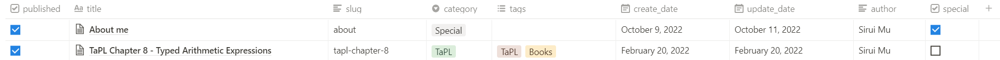

# Blogging with Notion

This document introduces how to write and manage your blog articles in Notion and serve them via `ublog`.

## Create Notion Database

First, you need to create a _Notion database_ to manager your blog articles.
`ublog` fetches pages contained in this Notion database, render these pages as blog articles and serves them.

This Notion database should have the following columns and corresponding column types:

- `published`, which should be a _chekbox_ column. This column indicates whether the corresponding page is considered published and should be served by `ublog`.
- `title`, which should be a _title_ column. This column gives the title of the article.
- `slug`, which should be a _text_ column. This column gives a brief slug label to each article and must be **unique** for each article.
- `category`, which should be a _single select_ column. This column gives the category of the article.
- `tags`, which should be a _multiselect_ column. This column gives the set of tags associated with the article.
- `create_date`, which should be a _date_ column. This column gives the creation date of the article.
- `update_date`, which should be a _date_ column. This column gives the update date of the article. `ublog` uses this column to determine whether updates should be made to an already served article.
- `special`, which should be a _checkbox_ column. This column indicates whether the article is a _special article_. A special article will not be listed in the posts list, however they serve as individual special pages to the blog site. Example special articles include the "about" page, which is a special article with the slug `about`.

The following figure shows the required Notion database schema described above:



## Fetch Articles

`ublog` does not automatically fetch articles from Notion.
Instead, you request `ublog` to fetch articles and update local copies.

To fetch articles from Notion database, execute the following command:

```bash
ublog fetch-notion -t <secret> <database>
```

`<secret>` is the Notion integration token used for accessing your database. `<database>` is the Notion database's ID.

By default, the `fetch-notion` command fetches Notion articles and updates blog articles stored in the local blog database file `ublog.db` in the working directory. To specify the path to the blog database file, use the `-d` switch.
